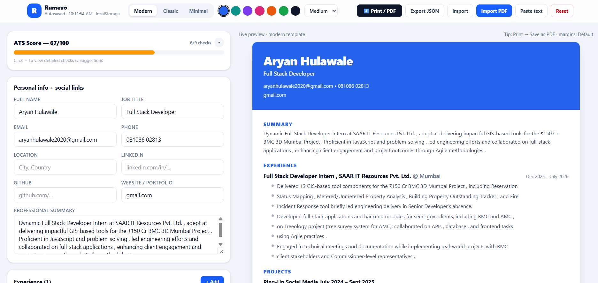

# Resume Builder — Create, Preview & Export PDF

A fast, privacy-friendly Resume Builder built with **React + Vite + Tailwind CSS**.
Write your resume on the left, see a live A4-ready preview on the right, check your ATS score, and Print / Save as PDF in one click. No backend, no signup — data stays in your browser via `localStorage`.


> To add the screenshot: run `npm run dev`, take a screenshot of the app at `http://localhost:5173`, save it as `public/screenshot.png`, and it will show up here automatically.

## Why this was made

Job seekers struggle with:
1. Resume templates that break in Word / Google Docs
2. No feedback on ATS-friendliness (missing contact info, no metrics, weak verbs, too long/short)
3. Paid builders that lock PDF export behind paywalls
4. Losing progress when the page reloads

This project solves that with:
- **Live editor + preview** — what you type is what prints
- **Built-in ATS checker** (`src/lib/resume.js:computeATS`) — 9 checks, 0-100 score, actionable tips
- **3 print-safe templates** (Modern / Classic / Minimal) + 7 accent colors + 3 font sizes
- **Autosave to localStorage**, Export/Import JSON, one-click Reset to sample
- **Free PDF export** via browser Print → Save as PDF, with print CSS for clean A4 output
- **Vercel Analytics** integrated to understand visitors & page views

## Features

- Personal info, Experience (with bullets), Education, Skills, Projects, Certifications, Custom sections
- Reorder / delete entries, add/remove bullets
- ATS Score card with progress bar:
  - Contact completeness, Summary length (30-120 words)
  - Experience count, Bullets with metrics, Action verbs
  - Skills count (6+), Education, Links, Total length (200-900 words)
- Templates: Modern, Classic, Minimal
- Accent picker + Small/Medium/Large font size
- Print CSS: hides editor/header, expands preview, A4 `@page` margins
- Responsive: single column on mobile, `480px + preview` split on desktop
- Autosaved indicator with timestamp

## Tech Stack

- [React 19](https://react.dev/) + [Vite 8](https://vite.dev/)
- [Tailwind CSS v4](https://tailwindcss.com/) via `@tailwindcss/vite`
- [@vercel/analytics](https://vercel.com/analytics) for page views & visitors
- `localStorage` for persistence, no backend

## Getting Started

```bash
npm install
npm run dev      # http://localhost:5173
npm run build    # production build -> dist/
npm run preview  # preview production build
npm run lint     # oxlint
```

## Analytics Setup (Vercel Analytics)

This project uses Vercel Analytics to count visitors and page views.

Your screenshot shows the **Next.js** instructions:
```bash
npm i @vercel/analytics
```
```js
import { Analytics } from "@vercel/analytics/next"
```

**Important:** This repo is **Vite + React (not Next.js)**, so the correct import is `/react`:

1. Install (already done, in `package.json`):
```bash
npm i @vercel/analytics
```

2. Add the component — done in `src/App.jsx`:
```jsx
import { Analytics } from "@vercel/analytics/react";

export default function App() {
  return (
    <div className="min-h-screen text-slate-900">
      <Analytics />
      {/* ...rest of app */}
    </div>
  );
}
```

3. Deploy & Visit your site:
- Deploy to Vercel (`vercel --prod` or GitHub import)
- Visit the deployment, navigate between views
- Data appears in Vercel Dashboard → Analytics within ~30 seconds
- If no data: disable ad/content blockers and try again

Reference: https://vercel.com/docs/analytics/quickstart

Files changed for analytics:
- `package.json` — added `@vercel/analytics@^2.0.1`
- `src/App.jsx:2,60` — `import { Analytics } ...` + `<Analytics />`

## Project Structure

```
index.html          # title: Resume Builder — Create, Preview & Export PDF
src/
  main.jsx          # React root
  App.jsx           # layout, header, ATS card, Analytics
  index.css         # tailwind + print/A4 CSS + slim scrollbars
  components/
    Editor.jsx      # all form sections
    Preview.jsx     # 3 templates, A4 paper (#resume-preview-paper)
  lib/
    resume.js       # defaultResume, load/save, computeATS, moveItem
public/
  favicon.svg
  icons.svg
  screenshot.png    # <-- add your screenshot here
```

## Usage

1. Edit on the left — preview updates live
2. Watch ATS Score — aim for 80+/100, fix `!` tips
3. Pick Template / Accent / Font size in header
4. `Print / PDF` → Destination: Save as PDF, Margins: Default
5. `Export JSON` to backup, `Import` to restore, `Reset` for sample data

Data key: `localStorage["resume-builder-v1"]`

## Deployment

Works on Vercel, Netlify, GitHub Pages (static `dist/`):

Vercel:
```bash
npm i -g vercel
vercel --prod
# Enable Analytics in Dashboard → Project → Analytics → Enable
```

## Screenshot

Replace `public/screenshot.png` with your own:
1. `npm run dev`
2. Fill in a good-looking resume, maximize window
3. Screenshot → save as `public/screenshot.png`
4. Commit — README image updates automatically

## License

MIT — free to use for personal / commercial resumes.
